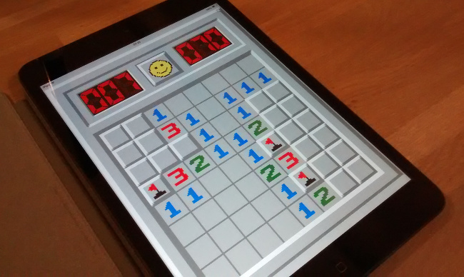

pythonista-minesweeper
======================

Minesweeper game for iOS in Python (requires [Pythonista](http://omz-software.com/pythonista/)).

Uses a [Minesweeper X](http://www.curtisbright.com/msx/) skin that is Base64 encoded in the source-code.

see: http://tqdev.com/2016-minesweeper-in-python-for-ipad
